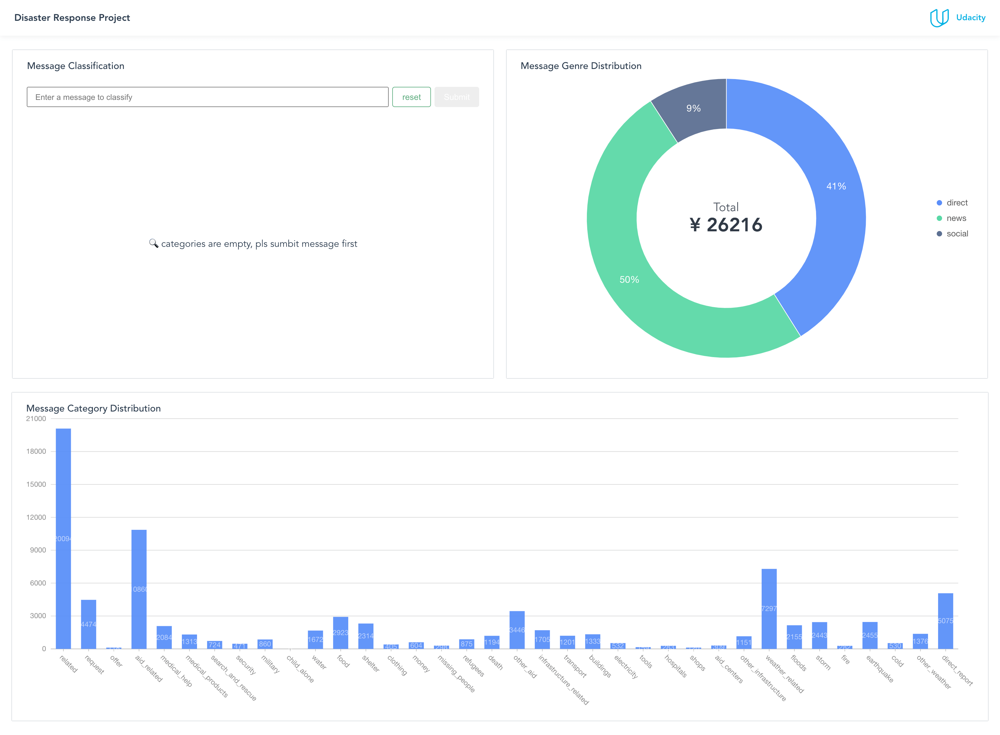
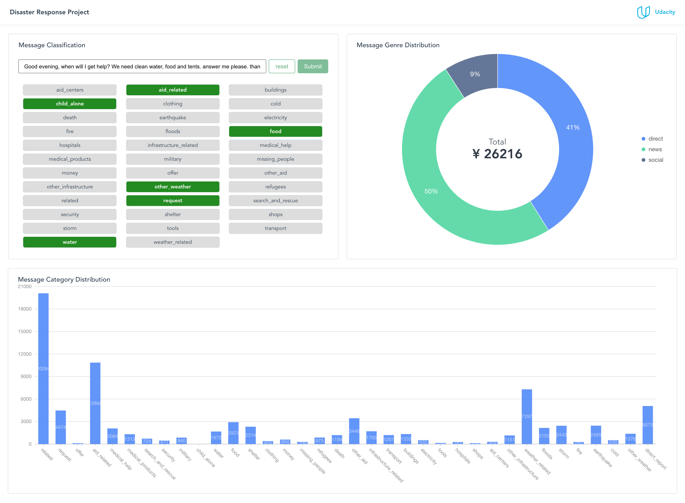

# Disaster Response Pipeline & Web app

## Description
This repo is part of Data Science Nanodegree Program with data from Figure Eight aiming to build a ML model (based on NLP) to categorize messages in a real time and visualize historical data.

This project is consists of four sections:

1. Process data through an ETL pipeline and save them into a SQLiteDB.
2. Build a ML pipeline to train the model to classify various text message.
3. Build backend APIs with flask to support the web app.
4. Run a web app which that users can see the charts and do real-time classification. 

## Getting Started

### Dependencies
* Python 3.8+
* Machine Learning Libraries: NumPy, SciPy, Pandas, Sciki-Learn
* Natural Language Process Libraries: NLTK
* SQLlite Database Libraqries: SQLalchemy
* Model Loading and Saving Library: Pickle
* Web Backend API: Flask
* NodeJs 14.0+

### Executing Program:
1. You can run the following commands in the project's directory to load data in csv file into database, train and generate the model as .pkl file.
    - ETL pipeline: 
        `python data/process_data.py data/disaster_messages.csv data/disaster_categories.csv data/disaster_response_db.db`
    - ML pipeline:
        `python models/train_classifier.py data/disaster_response_db.db models/classifier.pkl`

2. Go to `app` folder and run `python run.py` to start backend API.
    
3. Start another terminal, go to `app` folder and run `npm i` or `yarn` to install necessary packages of the front-end package, then run `npm serve` after installation.
   
4. Go to http://localhost:8080/

### Files
**app/dashboard/***: front-end web app project

**app/api.py**: Script to launch the Flask web back-end API

**app/api-doc.yaml**: Document of the back-end API in yaml

**data/process_data.py**: ETL pipeline for data cleaning, feature extraction, and storing data in SQLite

**models/train_classifier.py**: ML pipeline that loads data, trains and evaluate a pipeline, and saves the trained model as a .pkl file

### Jupyter Files

There are two jupyter notebook in the **data** and **models** folder which can help you understand how the pipeline is built.
You can use **ML Pipeline Preparation Notebook** to retrain the model and tune it by Grid Search.

## Screenshots

1. This is the home page to the disaster response app:

2. After inputing message and clicking **Submit** button, we can see the categories highlighted

